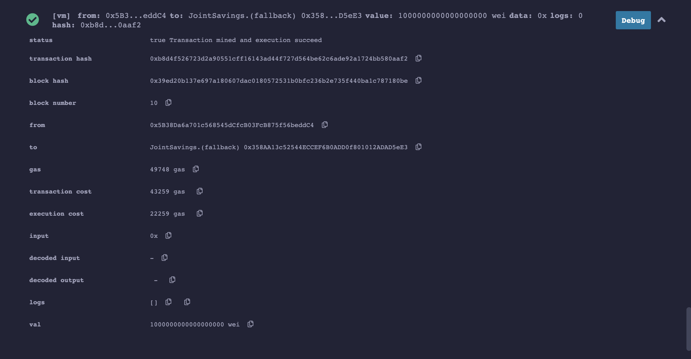

# solidity_homework

## Screenshots 

#### Funtion - setAccounts - Added Account1 and Account2

#### 1 ETH depot

#### 10 ETH depot

#### 5 ETH depot

#### 5 ETH withdrawal to Account1

#### Verification after 5 ETH withdrawal to Account1

#### 10 ETH withdrawal to Account2

#### Verification after 10 ETH withdrawal to Account2

